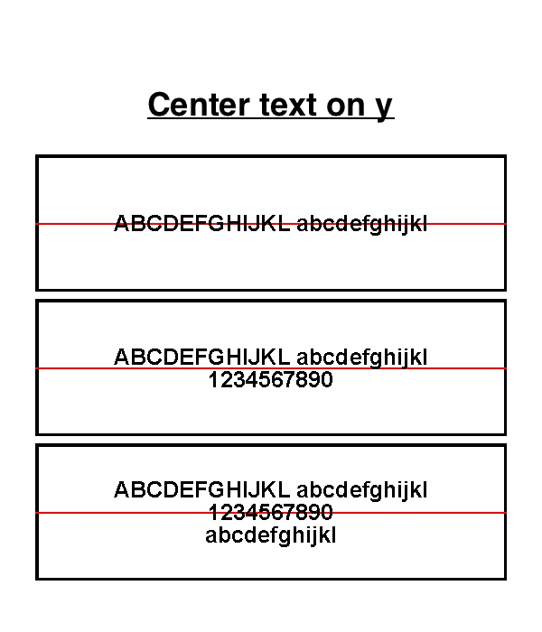

# OEPL_HA-Center-multiline-text-on-y



```yaml
alias: list center on y
description: Test
triggers:
  - entity_id:
      - sensor.veckans_tv
      - sensor.dayoftheweek
    trigger: state
conditions: []
actions:
  - metadata: {}
    data:
      dry-run: false
      background: white
      rotate: 0
      payload:
        - type: rectangle
          x_start: 0
          x_end: 522
          y_start: 0
          y_end: 152
          width: 4
          outline: black
        - type: line
          x_start: 0
          x_end: 522
          y_start: 76
          y_end: 76
          width: 2
          fill: red
        - type: multiline
          value: "{{list[0]}}"
          delimiter: "|"
          font: /media/arialbd.ttf
          anchor: mm
          start_y: "{{y_mid_list - offset[lines]|int}}"
          offset_y: "{{f_size}}"
          x: "{{mid_x}}"
          size: 25
          color: black
    target:
      device_id:
        - xxxxxxxxxx7019dc99aa7025fb37
    action: open_epaper_link.drawcustom
variables:
  list:
    - ABCDEFGHIJKL abcdefghijkl|1234567890|abcdefghijkl|0987654321|!#€%&/()*
  f_size: 25
  mid_x: 261
  mid_y: 64
  y_mid_list: 76
  lines: "{{list[0].split('|')|length-1}}"
  offset:
    - 0
    - "{{f_size/2|int}}"
    - "{{f_size/2|int*2}}"
    - "{{f_size/2|int*3}}"
    - "{{f_size/2|int*4}}"
```
